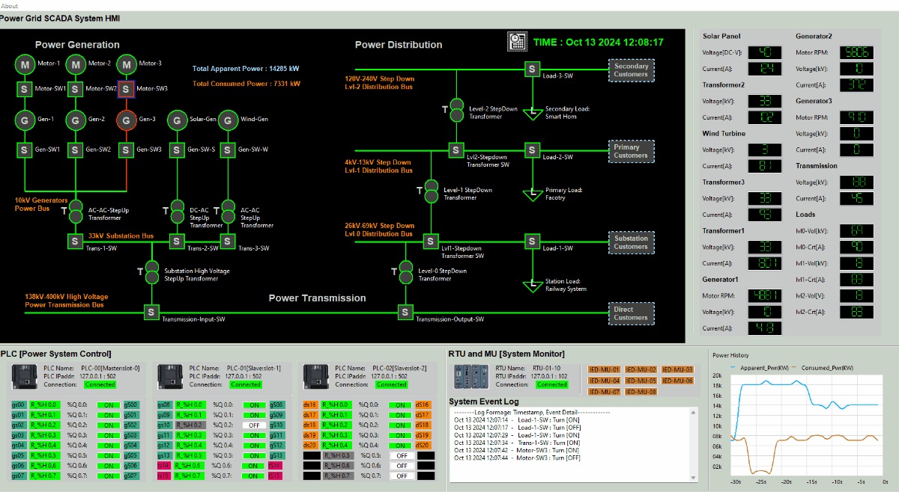

# Power_Grid_OT_Simulation_System

### Mini OT-Energy-System Cyber Security Digital Twin


` Figure-00: Power_Grid_OT_Simulation_System Environment Diagram, version v0.1.2 (2024)`

**Project Design Purpose**: 

The primary objective of this project is to develop a scaled-down Operational Technology (OT) digital twin/equivalent — an advanced software simulation system capable of emulating the functionality of an small-sized 18KW (560+MkWh/year) hybrid power grid. This system will meet the requirements for cybersecurity training, exercises, and research, serving as an essential platform for assessing the resilience and security of OT environments in power systems.

The simulation provides a modular, comprehensive approach to replicating real-world power generation, transmission, and distribution processes. It will integrate physical-world simulation with various control and monitoring units, including electrical metering units (MUs), programmable logic controllers (PLCs), remote terminal units (RTUs), and a SCADA-HMI interface. By offering full-spectrum emulation from Level 0 (physical field devices and sensors) to Level 2 (control center operations) as shown in the `figure-00`, this platform creates a robust environment to simulate operational activities and vulnerabilities.

The platform consists of three primary components, each targeting a different level of OT system requirements:

- `OT Level 0`: A 2D simulation program representing the physical-world processes of a power grid, including energy generation from natural gas, solar, and wind sources, as well as the physical flow of electricity through transmission lines and distribution networks.
- `OT Level 1`: Simulation of power system controllers, including MU, PLC, and RTU functionalities, responsible for gathering, processing, and transmitting data from field devices to supervisory systems.
- `OT Level 2`: A fully integrated SCADA-HMI system that provides real-time visualization, monitoring, and control of the simulated power grid, ensuring seamless interaction with the OT environment.

We Follow the [International Electrotechnical Commission](https://iec.ch/) IEC 61850, IEC 60617 standard when design and built the system, the system is a POC project and the real world energy system is more complex. This cyber range platform serves multiple purposes including cyber exercises, ICS professional training, OT security project R&D, testing and demonstration (Such as conducting cyber security exercises to demonstrate and assess the impact of various IT attacks on OT systems). 

**Project demo Video**: https://youtu.be/e6M78G84zvg?si=BUI0HOx_aJ74MDt5

```python
# version:     v0.1.2
# Created:     2024/08/21
# Copyright:   Copyright (c) 2024 LiuYuancheng
# License:     MIT License
```

**Table of Contents**

[TOC]

- [Power_Grid_OT_Simulation_System](#power-grid-ot-simulation-system)
    + [Mini OT-Energy-System Cyber Security Digital Twin](#mini-ot-energy-system-cyber-security-digital-twin)
    + [Introduction](#introduction)
      - [2D Power Grid Physical-world Simulation Introduction](#2d-power-grid-physical-world-simulation-introduction)
      - [Power System Controller Simulation (MU, PLC & RTU) Introduction](#power-system-controller-simulation--mu--plc---rtu--introduction)
      - [Power Grid Supervisory Human Machine Interface (HMI) Introduction](#power-grid-supervisory-human-machine-interface--hmi--introduction)
    + [System Design](#system-design)
      - [System Network Design](#system-network-design)
      - [Physical World Simulator Energy Flow Design](#physical-world-simulator-energy-flow-design)
      - [PLC and Remote Control Circuit Breaker Design](#plc-and-remote-control-circuit-breaker-design)
      - [MU-RTU Monitor System Design](#mu-rtu-monitor-system-design)
      - 

------

### Introduction 

The **Mini OT-Energy-System Cyber Security Test Platform** is a comprehensive software platform designed to simulate the essential operations of a small-scale hybrid power grid. The key objectives of this project will cover:

- **Cybersecurity Training & Exercises**: The platform will enable hands-on cybersecurity exercises, allowing professionals to explore and mitigate the effects of various cyber-attacks on OT systems.
- **OT System Simulation**: Simulating power grid operations with components that follow the [International Electrotechnical Commission](https://iec.ch/) standards, particularly IEC 61850 (communication networks and systems for power utility automation) and IEC 60617 (graphical symbols for diagrams), ensuring adherence to industry protocols.
- **Research & Development (R&D)**: Providing a research platform to explore and develop novel cybersecurity strategies, protocols, and solutions specifically for OT systems in the energy sector.
- **Training for ICS Professionals**: Offering a realistic environment for industrial control system (ICS) professionals to enhance their understanding of OT operations and cyber-attack scenarios in a controlled, risk-free setting.
- **R&D and Testing**: Facilitating the testing of new OT security tools and protocols, as well as demonstrating the impact of cyber-attacks on critical infrastructures, such as power generation and distribution networks.

This digital twin provides a dynamic environment for simulating power generation from multiple sources, including natural gas power plants, solar farms, and wind turbine farms. It also simulates high-voltage power transmission and a three-level step-down distribution system. The system overview is shown below:


` Figure-01: Power_Grid_OT_Simulation System Overview Diagram, version v0.1.2 (2024)`

At the core of the system is a SCADA (Supervisory Control and Data Acquisition) system, which integrates key components such as Programmable Logic Controllers (PLCs), Remote Terminal Units (RTUs), and Metering Units (MUs). These components work together to enable real-time data monitoring, control, and communication, while an intuitive Human-Machine Interface (HMI) allows operators to oversee and manage grid activities. The platform follows the IEC 61850 standard for power system communications, ensuring compatibility with modern power grid structures.

The system architecture consists of three primary modules:

- **2D Visualization Program**: Simulates the physical-world devices and components of the power grid, providing a clear visual representation of grid operations.
- **OT Field Controller Simulation**: Includes simulation programs for PLCs, sensors, Metering Units (MUs), and Remote Control Units (RTUs) that enable interaction between the grid’s physical elements and the control systems.
- **SCADA-HMI System**: Provides supervisory control and real-time monitoring of the simulated power grid, allowing for detailed oversight of grid performance and operations.

Beyond replicating traditional grid functionalities, the simulation also incorporates smart grid features. This includes automated detection of unusual situations, alerts, and adaptive generation-load balancing to emulate how modern power grids respond to disruptions and maintain system equilibrium.


#### 2D Power Grid Physical-world Simulation Introduction

The **Physical-world Simulator** is a 2D visualization tool designed to replicate real-world activities within a power and energy system. It simulates the flow of both data and energy across various components such as `motor driven generators`, `solar panels`, `wind turbines`, `power cables`, `energy storage units (batteries)`, `circuit breakers`, and `step-up/step-down transformers`, `138kV high-voltage transmission lines` and `power distribution networks` serving different customer voltage requirements. The UI screen shot is shown below:


` Figure-02: Power Grid Simulation Physical  world simulator UI screen short, version v0.1.2 (2024)`

This simulator provides several interfaces for enhanced functionality:

- **Logistic Level Signal Simulation**: Simulates voltage high/low signals for interaction with the PLC simulator, enabling control system logic testing.
- **Analog Level Signal Simulation**: Simulates linear analog signals (such as Volt, Amp, Wat and RPM) that are fed into Metering Units (MU) and RTU simulators, ensuring accurate data flow representation.
- **Weather Integration**: Interfaces with live city weather data to dynamically adjust solar and wind power generation based on real-world conditions, reflecting the impact of environmental factors on energy production.
- **Power Link Interface**: Connects to other digital equivalent systems (such as railway systems or smart factories) to share "power" status data, enabling integrated simulations across multiple digital infrastructures.

The simulator provides a highly visual and interactive environment, allowing users to observe how various components of the power grid function and interact, offering a realistic view of energy production, transmission, and distribution processes.


#### Power System Controller Simulation (MU, PLC & RTU) Introduction

The **OT Field Controller System** plays a pivotal role in managing data and control flows between the 2D Power Grid Physical-world Simulation and the SCADA system. It automates the operation of electrical devices, gathers real-time data from the grid simulation, and relays critical information to the Human-Machine Interface (HMI) in the SCADA system. Additionally, it receives control commands from the HMI, adjusting the state of relevant components in the physical-world simulation accordingly. The system work flow diagram is shown below:


` Figure-03: Power Grid Simulation system work flow diagram, version v0.1.2 (2024)`

Key features of the controller system include:

- **PLCs and Circuit Breaker Control**: Three PLCs are connected to 23 remote-controlled circuit breakers within the Physical-world Simulator. They communicate with the HMI using the Modbus-TCP protocol (IEC 61850), allowing operators to manage grid operations in real-time.
- **Measurement Units (MU) and Sensor Data Collection**: Eight MUs are connected to 29 Sampled Value (SV) sensors that collect data from the grid. This data is processed and transmitted to a Remote Terminal Unit (RTU), following the IEC 61850 workflow (current version we use PLC to simulate the SV-IED-MMS-RTU flow).
- **RTU Data Feedback**: The RTU consolidates data from the eight MUs and sends processed information back to the HMI for monitoring and control purposes.

This simulation replicates real-world power system operations, ensuring seamless integration between control devices and grid components while allowing users to monitor and manipulate the system through an intuitive SCADA-HMI interface.


#### Power Grid Supervisory Human Machine Interface (HMI) Introduction

The **SCADA-HMI** serves as the central interface for power grid operators, connecting to all PLC and RTU systems to enable efficient control and real-time monitoring of the power grid. It provides operators with advanced features such as double safety control mechanisms, monitoring of controller conditions, and automated balancing of energy generation and consumption. These features ensure safe, efficient, and reliable grid operations. The HMI UI screen shot is shown below: 



` Figure-04: Power Grid Simulation SCADA-HMI simulator UI screen short, version v0.1.2 (2024)`

The key components of the HMI include:

- **Circuit Diagram Interface**: Following the IEC 60617 standard for graphical symbols, this interface allows operators to monitor and control circuit breakers and switches across the grid.
- **Connection and Working Condition Panel**: Displays real-time operational statuses of all PLCs and RTUs, along with a log panel for reviewing system event history and diagnostics.
- **MU Data Panel**: Shows data collected from all metering units, providing insights into grid performance and operational parameters.
- **Load Display Panel**: Displays both current and historical data on energy generation and consumption, helping operators maintain balance within the grid.

This user-friendly HMI ensures that operators have complete visibility and control over the entire power grid system, promoting safe and effective power management.


------

### System Design

#### System Network Design 

The system include 3 subnet (ICS supervision SCADA network , ICS production network and Physical world simulation network ), each sub net represent one layer of OT environment. The ICS network use IEC61850 protocol and the physical world network use UDP to simulate the electrical signal. The network diagram is shown below:


` Figure-05: Power Grid Simulation System network diagram and components View, version v0.1.2 (2024)`

- **Supervision SCADA network**: A subnet simulating the `Level 2 Control Center (HQ) Processing LAN` of Energy OT environment , this subnet features distinct, SCADA data/historian servers, HMI computers for system operators, and maintenance computers dedicated to Blue team ICS/OT-system engineers.
- **Production network**: This subnet host all ICS field device PLC & RTU simulator programs, contributing to a realistic representation of the production (Field Device Controllers) environment within the energy system. It will simulate the `Level 1 Controller LAN` of the OT environment.  
- **Physical World Simulation Network** : In this subnet, railway real-world components are emulated to demonstrate the tangible effects of actual physical items / device (generators, transformers, switches ...) in the real world, all the device simulation program will running in this subnet to generate the "virtual" electrical signal and feed the signal in the PLC and RTU in the production network. This network will simulate the `Level 0 Physical Process Field I/O devices` of the OT environment. 


#### Physical World Simulator Energy Flow Design

The Physical World Simulation Program models a detailed, interactive environment that replicates the energy generation, transmission, and distribution processes within a hybrid power grid system. It features five power generation sources across three types, which feed power to a central substation. The system also incorporates power storage units to balance energy generation, ensuring consistent supply.

The simulator integrates real-time weather data to adjust the power output from renewable energy sources, such as solar panels and wind turbines, which operate based on environmental conditions. Generators powered by natural gas can be controlled via the Human-Machine Interface (HMI), allowing operators to adjust energy production as needed. Circuit breakers are placed between each component and can be manually controlled through the HMI, providing a realistic simulation of grid management.

**Solar Panel Energy Farm Design**

The Solar Energy Farm simulates multiple solar panels producing 12-48V DC with a maximum output of 120 Amps. This power is converted to 480V AC via a DC-to-AC converter, which is then stepped up to 33kV using a transformer for transmission to the substation. The solar farm includes built-in power storage to stabilize power output, adjusting generation based on system time and weather conditions. During nighttime or adverse weather (e.g., rain or cloudy skies), power output will drop accordingly.

Workflow Diagram:


**Wind Turbine Energy Farm Design**

The Wind Turbine Energy Farm simulates multiple wind generators producing 3.3kV AC with a maximum output of 100 Amps. The generated power is stepped up to 33kV using a transformer before being transmitted to the substation. Unlike the solar farm, the wind farm does not include power storage; disconnecting the turbine blades will halt power generation. Power output dynamically adjusts based on the current wind speed, as provided by the online weather data.

Workflow Diagram:


**Natural Gas Power Plant Design**

The Natural Gas Power Plant consists of three motor-driven generators (two for regular use, one as backup). Each generator outputs 10kV AC with a maximum of 200 Amps. The power is routed through an AC bus, connected to a step-up transformer (10kV to 33kV) before being transmitted to the substation. This plant includes local power storage to manage load balancing effectively.

Workflow Diagram:


**High Voltage Transmission Design**

The High Voltage Transmission system simulates the transmission of 138kV power with a 4.54% power loss rate and a maximum current of 50 Amps. It consolidates energy from all generation sources (solar, wind, and natural gas) at the power substation before transmitting it.


**Level 0 Power Distribution**

Level 0 Power Distribution is the initial stage of power delivery, converting 138kV transmission voltage to 69kV. It serves direct customers, like railway systems, and provides power to the next level of the distribution network. The maximum current is 120 Amps.


**Level 1 Power Distribution**

Level 1 Power Distribution caters to customers requiring medium voltage (13kV). The Level 1 transformer steps down 69kV to 480V-13kV, providing power to primary customers like factories. It also supplies power to the next level of the distribution network.


**Level 2 Power Distribution**

Level 2 Power Distribution simulates standard residential and commercial power supply (110V-220V AC). The Level 2 step-down transformer converts 13kV to 110V-220V, delivering power to secondary customers, such as smart homes. The maximum current is 40 Amps.

Workflow Diagram:


#### PLC and Remote Control Circuit Breaker Design

The circuit breakers play a crucial role in managing the connection and disconnection of various power generation sources, transmission lines, and distribution networks, ensuring safe and efficient grid operations. The PLC and Remote Control Circuit Breaker design simulates the automated control of circuit breakers throughout the power grid system. Utilizing a PLC simulation program, it enables the remote control of circuit breakers, allowing operators to manage the grid effectively via SCADA systems.

The system design diagram is shown below:


` Figure-06: PLC and Remote Control Circuit Breaker Design diagram, version v0.1.2 (2024)`

For a detailed overview of how PLCs are used to control circuit breakers remotely, refer to this article:: [Use PLC to Remote Control Circuit Breaker in Power Digital Twin System](https://www.linkedin.com/pulse/use-plc-remote-control-circuit-breaker-power-system-yuancheng-liu-7ljxc/?trackingId=LfYvE61DTZS0RA0vqM5n8Q%3D%3D)

The system is designed to control 23 remote circuit breakers across the power grid's generation, transmission, and distribution systems. The diagram below illustrates the layout of these circuit breakers:

**Power Generation System**

16 Circuit Breakers: Manage the flow of power from solar panels, wind turbines, and natural gas generators. Breakers control connections between power generation units, energy storage, and step-up transformers. The detail is shown below:

| Idx  | Breaker ID (Physical World / HMI) | Breaker Linked Source                       | Breaker Linked Destination                 |
| ---- | --------------------------------- | ------------------------------------------- | ------------------------------------------ |
| 1    | Solar farm charge switch          | Solar farm output                           | Solar energy storage input                 |
| 2    | Solar farm output switch          | Solar farm output                           | Solar farm DC-AC step up transformer input |
| 3    | Transformer-01-SW                 | Solar farm DC-AC step up transformer output | Power substation input                     |
| 4    | Wind gen link switch              | Wind turbine blades                         | Wind turbine generator                     |
| 5    | Wind Gen Switch                   | Wind turbine generator output               | Wind farm AC-AC step up transformer input  |
| 6    | Transformer-02-SW                 | Wind farm AC-AC step up transformer output  | Power substation input                     |
| 7    | Gen-Driver-Motor-01               | Motor-01 Fuel pump                          |                                            |
| 8    | Driver-Motor-01-SW                | Motor-01output                              | Generator-01 input                         |
| 9    | Gen-01-SW                         | Generator-01 output                         | Natural Gas Power Plant AC Bus             |
| 10   | Gen-Driver-Motor-02               | Motor-02 Fuel pump                          |                                            |
| 11   | Driver-Motor-02-SW                | Motor-02 output                             | Generator-02 input                         |
| 12   | Gen-02-SW                         | Generator-02 output                         | Natural Gas Power Plant AC Bus             |
| 13   | Gen-Driver-Motor-03               | Backup Motor Fuel pump                      |                                            |
| 14   | Driver-Motor-03-SW                | Backup Motor output                         | Backup Generator input                     |
| 15   | Gen-03-SW                         | Backup generator output                     | Natural Gas Power Plant AC Bus             |
| 16   | Transformer-03-SW                 | Natural Gas Power Plant output              | Power substation input                     |

**Power Transmission System**

2 Circuit Breakers: Control the transmission of high-voltage power from the main substation to transmission towers and further to distribution substations.

| Idx  | Breaker ID (Physical World / HMI) | Breaker Linked Source                  | Breaker Linked Destination            |
| ---- | --------------------------------- | -------------------------------------- | ------------------------------------- |
| 17   | Substation SW                     | Power substation                       | High Voltage transmission tower input |
| 18   | Transmission SW                   | High Voltage transmission tower output | Power Distribution substation input   |

**Power Distribution System**

5 Circuit Breakers: Regulate the step-down process across different voltage levels, enabling safe and controlled power distribution to various consumers, including railway systems and industrial facilities.

| Idx  | Breaker ID (Physical World / HMI) | Breaker Linked Source                | Breaker Linked Destination              |
| ---- | --------------------------------- | ------------------------------------ | --------------------------------------- |
| 19   | Lvl0-Transformer-SW               | Power Distribution substation output | Lvl0-Transformer input                  |
| 20   | Lvl1-Transformer-SW               | Lvl0-Transformer output              | Lvl1-Transformer input                  |
| 21   | Lvl2-Transformer-SW               | Lvl1-Transformer output              | Lvl2-Transformer input                  |
| 22   | Load-Railway-SW                   | Lvl0-Transformer output              | Railway system digital twin power input |
| 23   | Load-Industrial-SW                | Lvl1-Transformer output              | Smart Factory digital twin power input  |

Each circuit breaker can be manually operated via Physical world control check box, HMI or controlled automatically by PLCs, ensuring flexibility in managing power flow and responding to grid demands.


#### MU-RTU Monitor System Design

The **MU-RTU Monitor System ** design currently utilizes S7Comm communication protocols, paired with the [HD67620-A1](https://www.adfweb.com/Home/products/IEC61850_PROFINET.asp?frompg=nav35_30) module, to simulate the IEC61850 MU-IED-RTU control sequence. Currently as we haven't find a good lib to simulate the MMS message communication well, so we temporarily use this solution to bridge the gap and in the next version we will improve this design. The following diagram provides an overview of the system structure:


` Figure-07: MU-RTU Monitor System Design diagram, version v0.1.2 (2024)`

The **SV (Sampled Values) metering units** (MUs) are responsible for collecting and monitoring data from various components throughout the power grid. Each MU detects specific parameters, including:

- **Work State:** Indicates the current operational state (e.g., running, idle, error).
- **Power Output State:** Monitors electrical parameters such as voltage and current.
- **Special State Indicators:** Tracks unique metrics, such as motor RPM or battery charge percentage.

In the program we also implemented the convertor interface in the HMI part and the data flow diagram (we will improve this design in the next version) is shown below: 

 

` Figure-08: MU-RTU Monitor System data flow diagram, version v0.1.2 (2024)`

A total of 20 Measurement Units (MUs) are integrated within the system, spanning the power generation, transmission, and distribution sections of the grid. Each unit is linked to specific components to provide comprehensive monitoring:

**Power Generation System:**

| Idx  | MU Set ID              | Sensor Num | Connected Components            | Metering Data                                    |
| ---- | ---------------------- | ---------- | ------------------------------- | ------------------------------------------------ |
| 1    | Solar Farm MU          | 3          | Solar Panel                     | Work State, Voltage, Current                     |
| 2    | Solar Storage MU       | 2          | Solar Power Storage Battery     | Battery Charge/Release, Battery Percentage       |
| 3    | Transformer-01-MU      | 3          | Solar Step-Up Transformer       | Work State, Voltage, Current                     |
| 4    | Wind Farm MU           | 4          | Wind Turbine                    | Work State, Turbine Blade RPM, Voltage, Current  |
| 5    | Transformer-02-MU      | 3          | Wind Step-Up Transformer        | Work State, Voltage, Current                     |
| 6    | Motor-01-MU            | 3          | Generator-01 Driven Motor       | Work State, Throttle Percentage, RPM             |
| 7    | Gen-01-MU              | 4          | Generator 01                    | Work State, RPM, Voltage, Current                |
| 8    | Gen-02-MU              | 4          | Generator 02                    | Work State, RPM, Voltage, Current                |
| 9    | Backup Gen-03-MU       | 4          | Backup Generator                | Work State, RPM, Voltage, Current                |
| 10   | Transformer-03-MU      | 3          | Power Plant Step-Up Transformer | Work State, Voltage, Current                     |
| 11   | Power Plant Storage MU | 2          | Power Plant Storage             | Storage Power Charge/Release, Storage Percentage |

**Power Transmission System:**

| Idx  | MU Set ID             | Sensor Num | Connected Components     | Metering Data                                                |
| ---- | --------------------- | ---------- | ------------------------ | ------------------------------------------------------------ |
| 12   | Substation MU         | 8          | Power Substation         | Work State, Input Bus Voltage/Current, Output Transmission Voltage/Current, Power Storage Voltage/Current |
| 13   | Substation Storage MU | 2          | Substation Power Storage | Storage Power Charge/Release, Storage Percentage             |
| 14   | Transmission MU       | 2          | Transmission Line        | High Voltage Transmission Voltage, Current                   |

**Power Distribution System:**

| Idx  | MU Set ID           | Sensor Num | Connected Components             | Metering Data                |
| ---- | ------------------- | ---------- | -------------------------------- | ---------------------------- |
| 15   | Lvl0-Transformer-MU | 3          | Level 0 Step-Down Transformer    | Work State, Voltage, Current |
| 16   | Station-Cus-MU      | 3          | Station Power Customer (Railway) | Work State, Voltage, Current |
| 17   | Lvl1-Transformer-MU | 3          | Level 1 Step-Down Transformer    | Work State, Voltage, Current |
| 18   | Primary-Cus-MU      | 3          | Primary Power Customer (Factory) | Work State, Voltage, Current |
| 19   | Lvl2-Transformer-MU | 3          | Level 2 Step-Down Transformer    | Work State, Voltage, Current |
| 20   | Secondary-Cus-MU    | 3          | Secondary Power Customer (Home)  | Work State, Voltage, Current |

> Future Enhancements: In the upcoming version, the design will be upgraded to include enhanced MMS communication and more robust integration between the MU, RTU, and HMI components, ensuring better interoperability and improved system performance.

------

### System Setup and Usage

If you want to use the system, please follow below section to setup and use the program.

#### System Setup

**Development/Execution Environment** : python 3.7.4+

**Additional Lib/Software Need** 

| Lib Module         | Version | Installation                 | Lib link                                 |
| ------------------ | ------- | ---------------------------- | ---------------------------------------- |
| **pyModbusTCP**    | 0.3.0   | `pip install pyModbusTCP`    | https://pypi.org/project/pyModbusTCP/    |
| **python_snap7**   | 1.3     | `pip install python-snap7`   | https://pypi.org/project/python-snap7/   |
| **wxPython**       | 4.1.0   | `pip install wxPython`       | https://pypi.org/project/wxPython/       |
| **python-weather** | 2.0.7   | `pip install python-weather` | https://pypi.org/project/python-weather/ |

If you use Ubuntu system, to install snap 7 please follow below steps:

```bash
$ sudo apt-get install software-properties-common
$ sudo add-apt-repository ppa:gijzelaar/snap7
$ sudo apt-get update
$ sudo apt-get install libsnap7-1 libsnap7-dev
$ pip install python-snap7==1.3
```

Reference: https://github.com/LiuYuancheng/PLC_and_RTU_Simulator/issues/2#issuecomment-2244070501

**Program Source File List** 

| Program File                    | Execution Env | Module Description                                           |
| ------------------------------- | ------------- | ------------------------------------------------------------ |
| `src/lib/*.py`                  | python 3      | All the library files.                                       |
| `src/Logs/*`                    | txt           | All the logs file for each sub system module                 |
| `src/PhysicalWorldEmu/*.py`     | python 3      | The power grid physical world simulation program and config files. |
| `src/plcCtrl/*.py`              | python 3      | The power grid Programmable Logic Controller simulation program and config files. |
| `src/powerlink/*.py`            | python 3      | The link program to fetch the power state from the power grid physical world simulator program and send to the target digital twin's physical world simulator. |
| `src/rtuCtrl/*.py`              | python 3      | The power grid Remote Terminal Unit simulation program and config files. |
| `src/ScadaHMI/*py`              | python 3      | The SCADA Human machine interface simulation program.        |
| `src/weatherAPI/*py`            | python 3      | Online weather fetch program and send to the power grid physical world simualtor. |
| `src/runHMI_PowerGrid_win.bat`  | Win           | Power grid HMI Window-OS execution file.                     |
| `src/runLINK_PowerGrid_win.bat` | Win           | Power link Window-OS execution file.                         |
| `src/runPLC_PowerGrid_win.bat`  | Win           | PLC Simulator Window-OS execution file.                      |
| `src/runPW_PowerGrid_win.bat`   | Win           | Power grid physical world simulator Window-OS execution file. |
| `src/runRTU_PowerGrid_win.bat`  | Win           | RTU Simulator Window-OS execution file.                      |
| `src/runWea_PowerGrid_win.bat`  | Win           | Realtime online whether information Windows-OS execution file. |


#### System Usage and Execution 

For Setup the system in a distribution network nodes please refer to the [UsageManual]()

For simple test and run on one local machine please follow below steps (It will be good if you also follow the execution sequence):

**Run the physical world simulator** 

```bash
cd src/PhysicalWorldEmu
mv powerGridPWConfig_template.txt powerGridPWConfig.txt
sudo python3 PowerGridPWRun.py
```

- For Windows user after change the config file name, double click the `src/runPW_PowerGrid_win.bat`


**Run the weather information fetcher**

Set the city string in the config file.

```bash
cd src/weatherFether
mv weatherConfig_template.txt weatherConfig.txt
sudo python3 weatherFetcher.py
```

- For Windows user after change the config file name, double click the `src/runWea_PowerGrid_win.bat`

**Run the power link program**

```bash
cd src/powerlink
python PowerLinkRun.py
```

- For Windows user after change the config file name, double click the `src/runLINK_PowerGrid_win.bat`

**Run the PLC simulator**

```bash
cd src/plcCtrl
mv plcConfig_template.txt plcConfig.txt
sudo python3 plcSimulatorPwr.py
```

- For Windows user after change the config file name, double click the `src/runPLC_PowerGrid_win.bat`


**Run the RTU simulator**

```bash
cd src/rtuCtrl
mv rtuConfig_template.txt rtuConfig.txt
sudo python3 rtuSimulatorPower.py
```

- For Windows user after change the config file name, double click the `src/runRTU_PowerGrid_win.bat`

**Run the Scada HMI simulator**

```bash
cd src/ScadaHMI
mv scadaHMIConfig_template.txt scadaHMIConfig.txt
sudo python3 ScadaHMIRun.py
```

- For Windows user after change the config file name, double click the `src/runHMI_PowerGrid_win.bat`

------

> last edit by LiuYuancheng (liu_yuan_cheng@hotmail.com) by 12/10/2024 if you have any problem, please send me a message. 
