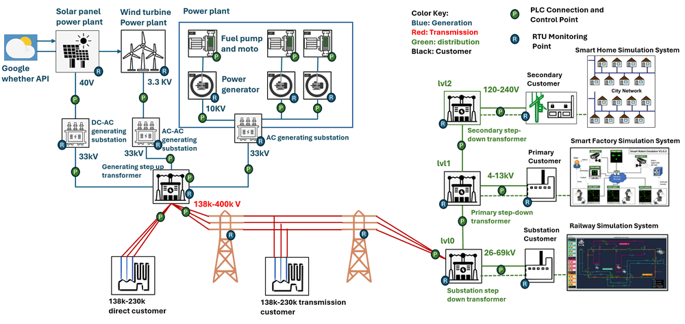

# Power_Grid_Simulation_System

**Project Design Purpose**:  The goal of this project is to develop a scaled-down cyber range capable of simulating a mid-sized 18KW hybrid power grid system to full fill the requirement of cyber security training, exercise and research. The system will serve as a simplified, digital-twin-style simulation platform for Operational Technology (OT) environments, encompassing power generation, transmission, and distribution processes. The project will offer a range of modular components, including physical world simulation, electrical metering units (MUs), PLCs, RTUs, and a SCADA-HMI interface. Together, these components will emulate the entire OT environment from Level 0 (Physical process field I/O devices) to Level 2 (Control center operations), providing a comprehensive simulation solution. 


```
# version:     v0.0.2
# Created:     2024/08/21
# Copyright:   Copyright (c) 2023 LiuYuancheng
# License:     MIT License
```

**Table of Contents**

[TOC]




Physical World simulation UI:


Power HMI:

