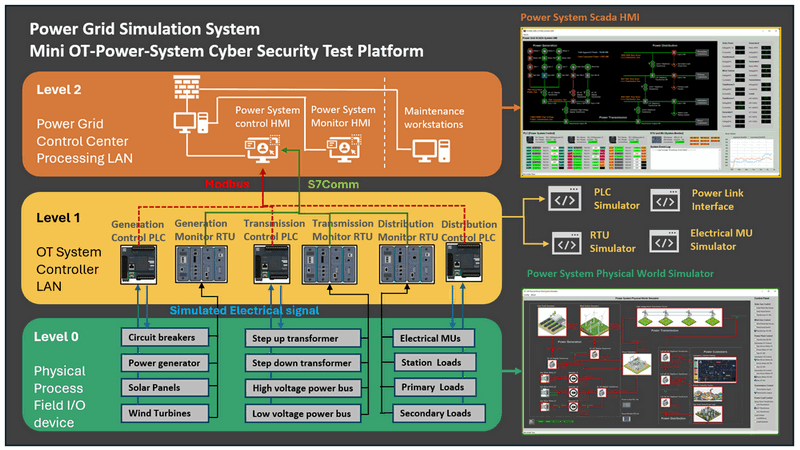

# Power_Grid_Simulation_System

**Project Design Purpose**:  The goal of this project is to develop a scaled-down cyber range capable of simulating a mid-sized 18KW hybrid power grid system to full fill the requirement of cyber security training, exercise and research. The system will serve as a simplified, digital-twin-style simulation platform for Operational Technology (OT) environments, encompassing power generation, transmission, and distribution processes. The project will offer a range of modular components, including physical world simulation, electrical metering units (MUs), PLCs, RTUs, and a SCADA-HMI interface. Together, these components will emulate the entire OT environment from Level 0 (Physical process field I/O devices) to Level 2 (Control center operations), providing a comprehensive simulation solution as illustrated below:



The platform comprises three primary components which cover different levels of the system requirement: 

- `Level 0` : 2D Power Grid Physical-world Simulation Program. 
- `Level 1`: Power System Controller Simulation (MU, PLC & RTU) Programs.
- `Level 2`: Power Grid Supervisory Control and Data Acquisition (SCADA)  System. 

This cyber range platform serves multiple purposes including cyber exercises, professional training, OT security project R&D, testing and demonstration (Such as conducting cyber security exercises to demonstrate and assess the impact of various IT attacks on OT systems). 

```
# version:     v0.0.2
# Created:     2024/08/21
# Copyright:   Copyright (c) 2023 LiuYuancheng
# License:     MIT License
```

**Table of Contents**

[TOC]

------

### Introduction 

The **Mini OT Power Grid Simulation System** is a digital equivalent software platform designed to simulate the core operations of a hybrid power grid system, including  hybrid power generation (natural gas power plants, solar power plants, and wind turbine farms), high-voltage power transmission and a three-level step-down power distribution system. The simulation integrates a SCADA system that incorporates PLCs for remote system control, RTUs and MUs for real-time data monitoring, and an HMI interface for operators to manage the grid. The system view is shown below:


In addition to simulating standard grid operations, the system replicates key smart grid functionalities, such as unusual situation detection, automated alerts, and generation-load management. This allows for a realistic simulation of how modern power grids respond to exceptions and maintain balance between power generation and consumption.


The mini OT Power Grid Simulation System is a digital equivalent software which simulate the basic logic of a hybrid power generation (Natural Gas Power Plant, Solar Power Plant, Wind Turbine Farm), high voltage power transmission and three level stepdown power distribution. The system will also provide the SCADA System of the power grid which includes PLC for system remote control , RTU and MU for system real time monitoring and HMI for power grid staff's operation. The system also simulate some basic smart power grid function such as the unusual situation detection, alert raising and auto generation-loads management to simulate how the current real world power grid handle these exception situation. 


 


Physical World simulation UI:


Power HMI:

